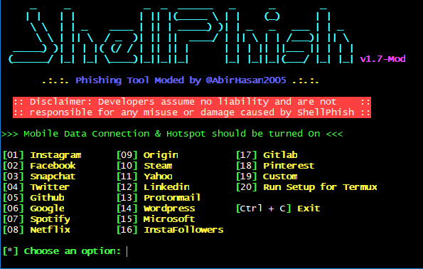

# ShellPhish v2.0-Mod
## First Coded by https://github.com/thelinuxchoice
## Modded by https://github.com/AbirHasan2005
### Don't copy these codes without giving me the credits. 
### This script uses some webpages generated by SocialFish Tool (https://github.com/UndeadSec/SocialFish)
### Instagram webpage generated by An0nUD4Y (@its_udy) (https://github.com/An0nUD4Y)

Phishing Tool for Instagram, Facebook, Twitter, Snapchat, Github, Yahoo, Protonmail, Google, Spotify, Netflix, Linkedin, Wordpress, Origin, Steam, Microsoft, InstaFollowers, Pinterest +1 customizable

## Mod Features:
```
• Colourized Text
• Animations
• In-built Setup for Termux
• More extra features
• More improvements
• Bugs cleared
• Fixed URL not showing
```


## How to Update:
```
cd ShellPhish
chmod +x *
bash update.sh
```

### Note: This is in development. If you find any problems than please report them to my Telegram Group.

### Port Forwarding using Ngrok or Serveo

## Legal disclaimer:

Usage of Shellphish for attacking targets without prior mutual consent is illegal. It's the end user's responsibility to obey all applicable local, state and federal laws. Developers assume no liability and are not responsible for any misuse or damage caused by this program.

### Usage:
```
apt update && apt upgrade -y
apt install git wget php unzip curl -y
git clone https://github.com/AbirHasan2005/ShellPhish
cd ShellPhish
chmod +x shellphish.sh
bash shellphish.sh
```

NOTE: To work properly in Android you have to Turn On Mobile Data and Hotspot. Without Mobile Data and Hotspot it will not download and generate URL.

### Telegram:

For any kind of help, support, suggetion and request ask in my
Telegram Group:
<a href="https://t.me/linux_repo"></a>

## Follow on:
<a href="https://github.com/AbirHasan2005"></a>
<a href="https://twitter.com/AbirHasan2005"></a>
<a href="https://facebook.com/AbirHasan2005"></a>
<a href="https://instagram.com/AbirHasan2005"></a>

[](https://paypal.me/AbirHasan2005?locale.x=en_US)
