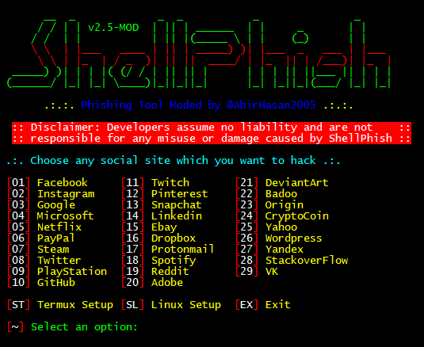
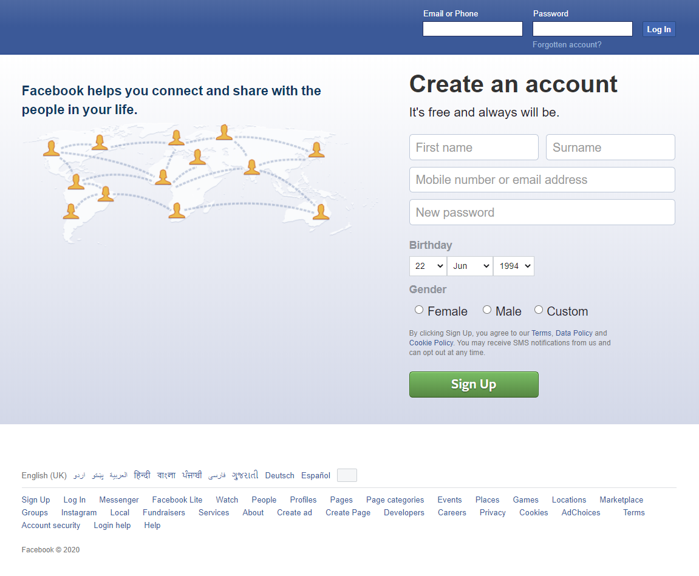

# ShellPhish v2.5-MOD
Phishing Tool for Facebook, Instagram, Google, Microsoft, Netflix, PayPal, Steam, Twitter, PlayStation, GitHub, Twitch, Pinterest, Snapchat, Linkedin, Ebay, Dropbox, Protonmail, Spotify, Reddit, Adobe, DeviantArt, Badoo, Origin, CryptoCoin, Yahoo, Wordpress, Yandex, StachoverFlow & VK. This is a modified version of ShellFish, ShellPhish & Zphisher.

## ChangeLog:
- Updated to v2.5:
	- Added 2020 New Login/Phishing Page.
	- Added Traditional Login Page.
	- Added Advanced Voting Poll Login Page.
	- Added Fake Security Login Page.
	- Added Facebook Messenger Login Page.
	- Improvements in ShellPhish Logo.
	- Added New Sites.
	- Added 4 Port Forwarding Options.

## List of available sites:
```
[01] Facebook     [11] Twitch       [21] DeviantArt
[02] Instagram    [12] Pinterest    [22] Badoo
[03] Google       [13] Snapchat     [23] Origin
[04] Microsoft    [14] Linkedin     [24] CryptoCoin
[05] Netflix      [15] Ebay         [25] Yahoo
[06] PayPal       [16] Dropbox      [26] Wordpress
[07] Steam        [17] Protonmail   [27] Yandex
[08] Twitter      [18] Spotify      [28] StackoverFlow
[09] PlayStation  [19] Reddit       [29] VK
[10] GitHub       [20] Adobe
```

## Mod Features:
- Colourized Text
- Animations
- In-built Setup for Termux
- More extra features
- More improvements
- Bugs cleared
- Fixed URL not showing





### Usage:
```bash
apt update && apt upgrade -y && apt install git wget php unzip curl -y && git clone https://github.com/AbirHasan2005/ShellPhish && cd ShellPhish && chmod +x * && bash shellphish.sh
```

## How to Update:
```bash
cd ShellPhish
bash update.sh
```

### Note:
**This is in development. If you find any problems than please report them to my Telegram Group. To work properly in Android you have to Turn On Mobile Data and Hotspot. Without Mobile Data and Hotspot sometimes it not generates Phishing URL.**

## Legal disclaimer:
***Usage of Shellphish for attacking targets without prior mutual consent is illegal. It's the end user's responsibility to obey all applicable local, state and federal laws. Developers assume no liability and are not responsible for any misuse or damage caused by this program.***

## Modified by @AbirHasan2005

## Credits:
#### TheLinuxChoice: https://github.com/thelinuxchoice
#### DarksecDevelopers: https://github.com/DarksecDevelopers
#### UndeadSec: https://github.com/UndeadSec
#### HTR-TECH: https://github.com/htr-tech

### Here ***sites*** folder collected from ZPhisher (https://github.com/htr-tech/zphisher)

### For any kind of help, support, suggetion and request ask in my Telegram Group:
<p align="left">
<a href="https://t.me/DevsZone"></a>
</p>

## Follow on:
<p align="left">
<a href="https://github.com/AbirHasan2005"></a>
</p><p align="left">
<a href="https://twitter.com/AbirHasan2005"></a>
</p><p align="left">
<a href="https://facebook.com/AbirHasan2005"></a>
</p><p align="left">
<a href="https://instagram.com/AbirHasan2005"></a>
</p>

## Doante Me:
[](https://paypal.me/AbirHasan2005)
